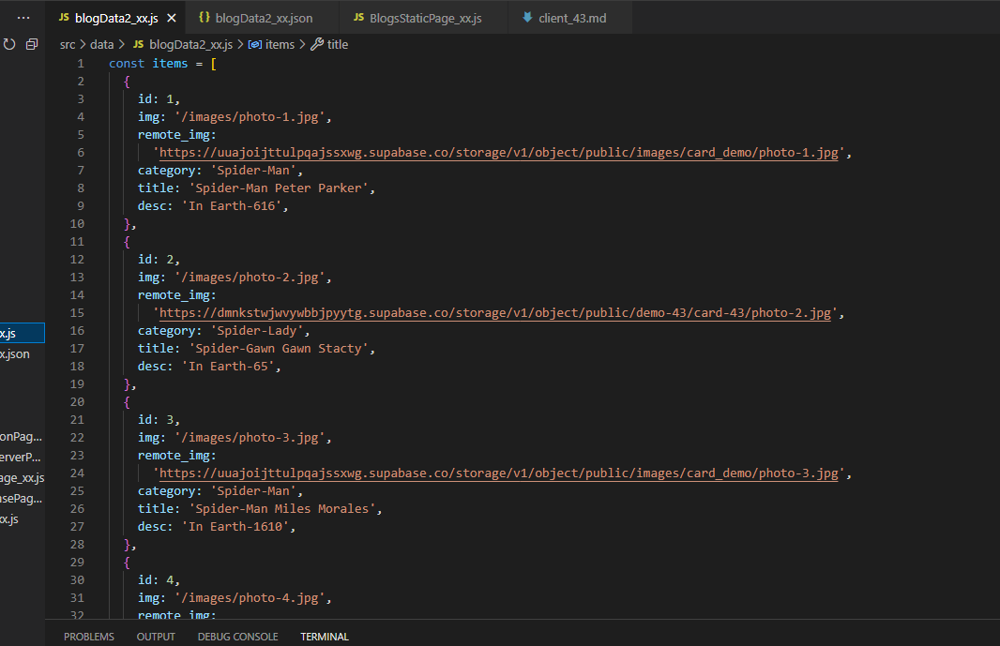
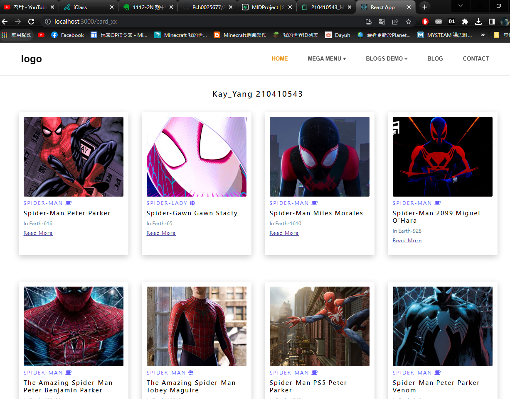
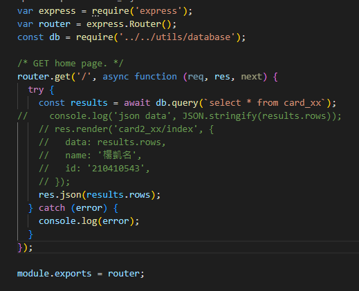

 ### S1. 前端 theme (html, css)
   S2. 提供相關的SQL指令，顯示如何將theme 內data放入資料庫中
   
   S3. 測試可以取得資料庫中的資料
    
   S4. 提供 api 路由，可以透過 api 路由取得 json data
   
   以上要以md檔及 git logs 呈現及說明你的實作步驟
   ```
   USER@DESKTOP-02A3VJM MINGW64 /d/homework/midproject__server_43 (master)
$ git log --pretty=format:"%h%x09%an%x09%ad%x09%s" --after="2023-4-22"
770c1a1 pch0025677      Sun Apr 23 19:49:44 2023 +0800  donn-3
a756fbc pch0025677      Sun Apr 23 19:42:48 2023 +0800  donn-2
9fc1cec pch0025677      Sun Apr 23 19:36:22 2023 +0800  done
   ```

 ### S1. 將前端 theme (html, css)，轉成 React components
   S2. 可以透過 server api 取得json資料，放入 React components
   S3. 可以直接透過  Supabase API 取得React components 所要的json資料
   S4. 請加入選單
   S5. 請使用 Context API 及 useReducer 來儲存資料
  以上要以md檔及 git logs 呈現及說明你的實作步驟

GITHUB:https://github.com/Pch0025677/112-MID-Server.git
VERCEL:https://vercel.com/pch0025677/112-mid-clien
RENDER:https://one12-mid-server.onrender.com